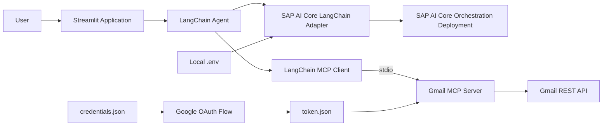

# Gmail MCP Assistant with SAP AI Core

A conversational Gmail assistant built with Python, Streamlit, LangChain, the Model Context Protocol (MCP), SAP AI Core, and the Gmail REST API.

The application allows a user to interact with Gmail using natural-language instructions. It can search and read messages, summarize conversations, create drafts, send new emails, and reply to existing Gmail threads.

The language model is accessed through an SAP AI Core Orchestration deployment, while Gmail capabilities are exposed to the agent through a local MCP server.

---

## Features

- Interactive Streamlit chat interface
- SAP AI Core Orchestration integration
- Support for Claude, Gemini, and GPT model configurations
- LangChain agent with tool-calling support
- Local Gmail MCP server using the standard input/output transport
- Gmail OAuth 2.0 authentication
- Search Gmail using Gmail query syntax
- Read individual messages and complete email threads
- Summarize recent and unread emails
- List Gmail labels
- Create Gmail drafts
- Send new emails
- Reply within existing Gmail threads
- Reply-all support
- Plain-text and HTML email support
- Local file attachment support
- OAuth token refresh support
- Explicit confirmation before sending outbound emails
- Physical removal of sending tools until the user confirms

---

## Architecture



---

## Technology Stack

| Component | Technology |
|---|---|
| Programming language | Python |
| User interface | Streamlit |
| AI model platform | SAP AI Core |
| Model orchestration | SAP AI Core Orchestration |
| Agent framework | LangChain |
| Agent execution runtime | LangGraph |
| Tool protocol | Model Context Protocol |
| MCP integration | LangChain MCP Adapters |
| Gmail integration | Gmail REST API |
| Google authentication | OAuth 2.0 |
| HTTP clients | Requests and HTTPX |
| Configuration | Python Dotenv |
| Data validation | Pydantic |

---

## Project Structure

```text
gmail-mcp-assistant-sap-ai-core/
├── .env.example
├── .gitignore
├── README.md
├── app.py
├── auth.py
├── gmail_mcp_server.py
├── initialize_model.py
└── requirements.txt
```

The following files are required locally but intentionally excluded from GitHub:

```text
.env
credentials.json
token.json
.venv/
__pycache__/
```

---

## Main Components

### `app.py`

The main Streamlit application.

It is responsible for:

- Rendering the chat interface
- Displaying the sidebar and model selector
- Maintaining conversation history using Streamlit session state
- Starting the Gmail MCP server
- Loading MCP tools into the LangChain agent
- Connecting the agent to the selected SAP AI Core model
- Providing quick Gmail actions
- Detecting explicit email-send confirmation
- Preventing send tools from being available before confirmation
- Displaying tool results and application errors

### `initialize_model.py`

A custom LangChain-compatible chat model for SAP AI Core Orchestration.

It is responsible for:

- Reading SAP AI Core configuration from `.env`
- Authenticating with SAP using OAuth client credentials
- Caching the SAP OAuth access token
- Converting LangChain messages into SAP Orchestration messages
- Converting MCP tools into model-compatible function definitions
- Sending prompts and tool definitions to SAP AI Core
- Extracting text and tool calls from the SAP response
- Returning LangChain `AIMessage` objects
- Supporting Claude, Gemini, and GPT model configurations

### `gmail_mcp_server.py`

A local MCP server that exposes Gmail operations as callable tools.

It is responsible for:

- Loading Gmail OAuth credentials from `token.json`
- Refreshing expired Google access tokens
- Calling Gmail REST API endpoints
- Reading plain-text and HTML email bodies
- Building MIME email messages
- Handling attachments
- Preserving Gmail conversation metadata when replying
- Returning structured JSON tool results

### `auth.py`

Performs the browser-based Google OAuth flow.

It:

1. Reads `credentials.json`
2. Opens the Google authorization page
3. Requests Gmail access
4. Saves the resulting access and refresh tokens to `token.json`

Run this file before starting the application for the first time.

---

## Available Gmail MCP Tools

| MCP tool | Description |
|---|---|
| `get_profile` | Returns the authenticated Gmail address and mailbox statistics |
| `search_threads` | Searches Gmail conversations using Gmail search syntax |
| `get_thread` | Retrieves every message in a Gmail thread |
| `get_message` | Retrieves a particular Gmail message |
| `list_labels` | Lists Gmail labels |
| `create_draft` | Creates an unsent Gmail draft |
| `send_email` | Sends a new email |
| `reply_to_thread` | Replies to the latest message in an existing thread |
| `reply_to_message` | Replies to the thread containing a specific message |

---

## Prerequisites

Before running the project, you need:

- Python 3.10 or later
- Git
- A GitHub account
- An SAP BTP account
- Access to SAP AI Core
- An SAP AI Core service instance
- SAP AI Core service credentials
- A running SAP AI Core Orchestration deployment
- Access to at least one supported generative AI model
- A Google account with Gmail enabled
- A Google Cloud project
- Gmail API enabled in the Google Cloud project
- Google OAuth Desktop application credentials

---

# Installation

## 1. Clone the repository

```bash
git clone https://github.com/kiruthiga-giridharan/gmail-mcp-assistant-sap-ai-core.git
cd gmail-mcp-assistant-sap-ai-core
```

## 2. Create a virtual environment

### Windows PowerShell

```powershell
python -m venv .venv
.venv\Scripts\Activate.ps1
```

When PowerShell blocks virtual-environment activation, run:

```powershell
Set-ExecutionPolicy -Scope Process -ExecutionPolicy RemoteSigned
.venv\Scripts\Activate.ps1
```

### macOS or Linux

```bash
python3 -m venv .venv
source .venv/bin/activate
```

## 3. Upgrade pip

```bash
python -m pip install --upgrade pip
```

## 4. Install dependencies

```bash
pip install -r requirements.txt
```

The project uses:

```text
langchain
langgraph
langchain-core
langchain-mcp-adapters
mcp
streamlit
python-dotenv
pydantic
requests
httpx
google-auth
google-auth-oauthlib
```

---

# SAP AI Core Setup

## 1. Obtain SAP AI Core service credentials

You need the following values from an SAP AI Core service key:

- OAuth authentication URL
- Client ID
- Client secret
- SAP AI Core API URL

You also need the deployment ID of a running SAP AI Core Orchestration deployment.

## 2. Create the local `.env` file

Copy `.env.example`:

### Windows PowerShell

```powershell
Copy-Item .env.example .env
```

### macOS or Linux

```bash
cp .env.example .env
```

Open `.env` and add the real SAP AI Core values:

```env
AUTH_URL=your-sap-oauth-token-url
CLIENT_ID=your-sap-client-id
CLIENT_SECRET=your-sap-client-secret
BASE_URL=your-sap-ai-core-api-url
ORCHESTRATION_DEPLOYMENT=your-orchestration-deployment-id
```

Example structure:

```env
AUTH_URL=https://your-subdomain.authentication.region.hana.ondemand.com/oauth/token
CLIENT_ID=your-client-id
CLIENT_SECRET=your-client-secret
BASE_URL=https://api.ai.your-region.example.com
ORCHESTRATION_DEPLOYMENT=your-deployment-id
```

Do not use the example values as real credentials.

## Optional model-name overrides

The application contains default model names in `initialize_model.py`.

They can optionally be overridden through `.env`:

```env
CLAUDE_MODEL_NAME=your-claude-model-name
GEMINI_MODEL_NAME=your-gemini-model-name
GPT_MODEL_NAME=your-gpt-model-name
```

These variables are optional. Add them only when the model names available in your SAP AI Core environment differ from the defaults in the code.

## SAP AI Core resource group

The current implementation sends:

```text
AI-Resource-Group: default
```

in the SAP AI Core request header.

When your deployment belongs to another resource group, update this header in `initialize_model.py`.

## Test SAP authentication

Start the Streamlit application after completing both SAP and Google configuration:

```bash
streamlit run app.py
```

An SAP configuration error will appear when any required environment variable is missing.

---

# Google Cloud Console Setup

This section explains how to configure Gmail API access for the application.

## 1. Create or select a Google Cloud project

1. Open Google Cloud Console.
2. Sign in using the Google account that will own the project.
3. Select the project selector at the top of the page.
4. Choose an existing project or select **New Project**.
5. Enter a project name, for example:

```text
Gmail MCP Assistant
```

6. Create the project.
7. Confirm that the new project is selected before continuing.

---

## 2. Enable the Gmail API

From the selected Google Cloud project:

1. Open:

```text
APIs & Services → Library
```

2. Search for:

```text
Gmail API
```

3. Select **Gmail API**.
4. Click **Enable**.

The application cannot access Gmail until the Gmail API is enabled for the project.

---

## 3. Configure Google Auth Platform branding

Open:

```text
Google Auth Platform → Branding
```

When Google Auth Platform has not been configured, click:

```text
Get Started
```

Provide the following information:

```text
App name: Gmail MCP Assistant
User support email: your-email-address
Developer contact email: your-email-address
```

Review the Google API Services User Data Policy and complete the initial configuration.

The app name entered here is displayed on the Google OAuth consent screen.

---

## 4. Configure the OAuth audience

Open:

```text
Google Auth Platform → Audience
```

### Personal Gmail account

For a personal Gmail account or users outside a Google Workspace organization, select:

```text
External
```

Leave the publishing status as:

```text
Testing
```

while developing the project.

Under:

```text
Test users
```

click:

```text
Add users
```

Add the Gmail address that will be used to test the assistant.

Only accounts listed as test users can normally authorize an external application while it remains in Testing status.

### Google Workspace organization

Select:

```text
Internal
```

only when:

- The Google Cloud project belongs to a Google Workspace organization
- The application will be used only by members of that organization
- Your Google Workspace administrator permits the application

A personal Gmail project normally uses the External audience.

---

## 5. Configure Gmail data access

Open:

```text
Google Auth Platform → Data Access
```

Select:

```text
Add or Remove Scopes
```

The current `auth.py` requests this Gmail scope:

```text
https://mail.google.com/
```

This permission allows the application to:

- Read Gmail messages
- Search Gmail messages and threads
- Create drafts
- Compose email
- Send email
- Modify Gmail content
- Permanently delete Gmail messages

The current application does not provide a tool for permanently deleting email, but the scope itself grants that permission.

This is a broad and restricted Gmail scope. Only authorize a Gmail account that you are permitted to use.

Save the selected scope configuration.

### Recommended future scope improvement

A future version should consider replacing:

```text
https://mail.google.com/
```

with:

```text
https://www.googleapis.com/auth/gmail.modify
```

The `gmail.modify` scope supports reading, composing, and sending Gmail messages without granting immediate permanent-deletion permission.

Changing the scope in `auth.py` requires deleting the existing `token.json` and completing Google authorization again.

---

## 6. Create OAuth Desktop application credentials

Open:

```text
Google Auth Platform → Clients
```

Then:

1. Click **Create Client**.
2. Select:

```text
Application type: Desktop app
```

3. Enter a name, for example:

```text
Gmail MCP Assistant Desktop Client
```

4. Click **Create**.
5. Download the OAuth client JSON file.

Rename the downloaded file to:

```text
credentials.json
```

Place it in the project root:

```text
gmail-mcp-assistant-sap-ai-core/
├── credentials.json
├── auth.py
├── app.py
├── gmail_mcp_server.py
└── ...
```

Do not commit `credentials.json` to GitHub.

---

## 7. Verify the local Google files

Before authorization, the project should contain:

```text
credentials.json
auth.py
```

The `credentials.json` file must be in the same project directory as `auth.py`.

Confirm it in Windows PowerShell:

```powershell
Get-ChildItem credentials.json
```

---

## 8. Authorize the Gmail account

With the virtual environment active, run:

```bash
python auth.py
```

A browser window should open.

Complete the following steps:

1. Select the Gmail account added as a test user.
2. Review the requested permissions.
3. Continue through any testing or unverified-app warning.
4. Approve access.
5. Return to the terminal.

After successful authorization, the terminal should display a message similar to:

```text
Gmail authorization completed. Token saved to: ...\token.json
```

The script creates:

```text
token.json
```

This file contains the Google access token and refresh token used by the Gmail MCP server.

Do not commit `token.json` to GitHub.

---

## 9. Testing-mode refresh-token expiration

When an External OAuth application remains in Testing status, the generated refresh token will generally expire after seven days.

When Gmail authorization stops working:

1. Stop Streamlit.
2. Delete the local token:

### Windows PowerShell

```powershell
Remove-Item token.json
```

### macOS or Linux

```bash
rm token.json
```

3. Run authorization again:

```bash
python auth.py
```

4. Complete the browser authorization flow.
5. Restart Streamlit.

---

# Running the Application

## 1. Activate the virtual environment

### Windows PowerShell

```powershell
.venv\Scripts\Activate.ps1
```

### macOS or Linux

```bash
source .venv/bin/activate
```

## 2. Confirm that local configuration files exist

```text
.env
credentials.json
token.json
```

## 3. Start Streamlit

```bash
streamlit run app.py
```

Streamlit normally opens the application automatically in the default browser.

When it does not open automatically, use the local URL displayed in the terminal.

---

# Using the Application

## Select an AI model

Use the sidebar to select:

```text
Claude
GPT
Gemini
```

The selected model must be available through your SAP AI Core Orchestration deployment.

## Read recent emails

Example:

```text
Show my five most recent emails. Include the sender, subject, date, and a short summary.
```

## Summarize unread emails

```text
Find my unread inbox emails and summarize the five most important ones.
```

## Search Gmail

```text
Find emails from example@company.com received during the last 30 days.
```

## List labels

```text
Show all labels in my Gmail account.
```

## Read a conversation

```text
Find my most recent conversation with example@company.com and summarize the complete thread.
```

## Create a draft

```text
Create a professional draft email to example@company.com asking for a project update.
```

## Send an email

```text
Send an email to example@company.com asking whether they are available for a meeting next week.
```

The assistant should first display the complete email draft and ask for confirmation.

## Reply to an existing thread

```text
Find my latest conversation with example@company.com and draft a reply thanking them for the update.
```

The assistant searches for the Gmail thread, reads the conversation, prepares a draft, and waits for confirmation before sending.

---

# Gmail Search Syntax

The `search_threads` tool supports Gmail search operators.

## Search by sender

```text
from:person@example.com
```

## Search by recipient

```text
to:person@example.com
```

## Search unread email

```text
is:unread
```

## Search email with attachments

```text
has:attachment
```

## Search recent email

```text
newer_than:30d
```

## Search by subject

```text
subject:invoice
```

## Combine search conditions

```text
from:person@example.com newer_than:30d
```

Search either sent or received conversations with a person:

```text
to:person@example.com OR from:person@example.com
```

---

# Outbound Email Safety

The application uses two separate controls before sending an email.

## 1. Agent instruction

The system prompt instructs the model to:

1. Prepare the complete draft
2. Display the recipient, subject, and body
3. Ask the user for confirmation
4. Revise the draft when requested
5. Send only after explicit approval

Examples of explicit approval include:

```text
Send it
Yes, send it
Proceed
Go ahead
```

## 2. Tool-level safety gate

The following MCP tools are physically removed from the active agent before explicit confirmation:

```text
send_email
reply_to_thread
reply_to_message
```

This is stronger than relying only on the system prompt.

Before confirmation, the agent cannot call these tools because they are not included in its available tool list.

After confirmation is detected, the application rebuilds the agent with the sending tools enabled.

---

# Attachments

The Gmail MCP tools support local file attachments.

Attachment paths must refer to files accessible on the machine running the application.

Do not allow untrusted users to provide arbitrary local file paths. A production application should restrict attachment access to an approved upload directory.

---

# Environment Variables

## Required variables

| Variable | Description |
|---|---|
| `AUTH_URL` | SAP OAuth token endpoint |
| `CLIENT_ID` | SAP OAuth client ID |
| `CLIENT_SECRET` | SAP OAuth client secret |
| `BASE_URL` | SAP AI Core API base URL |
| `ORCHESTRATION_DEPLOYMENT` | SAP AI Core Orchestration deployment ID |

## Optional variables

| Variable | Description |
|---|---|
| `CLAUDE_MODEL_NAME` | Overrides the default Claude model name |
| `GEMINI_MODEL_NAME` | Overrides the default Gemini model name |
| `GPT_MODEL_NAME` | Overrides the default GPT model name |

---

# Authentication Flow

The project uses two separate authentication systems.

## SAP AI Core authentication

```text
.env
  ↓
OAuth client-credentials request
  ↓
SAP OAuth access token
  ↓
SAP AI Core Orchestration API
```

## Gmail authentication

```text
credentials.json
  ↓
python auth.py
  ↓
Google browser authorization
  ↓
token.json
  ↓
Gmail REST API
```

Running `auth.py` configures Gmail authentication only. It does not configure SAP AI Core.

---

# Troubleshooting

## Missing SAP AI Core environment variables

Example:

```text
RuntimeError: Missing SAP AI Core environment variables
```

Confirm that `.env` contains:

```text
AUTH_URL
CLIENT_ID
CLIENT_SECRET
BASE_URL
ORCHESTRATION_DEPLOYMENT
```

Restart Streamlit after modifying `.env`.

---

## Gmail token file was not found

Example:

```text
Run auth.py first
```

Run:

```bash
python auth.py
```

Complete Google authorization and confirm that `token.json` was created.

---

## `credentials.json` was not found

Confirm that:

- The OAuth client JSON file was downloaded from Google Cloud Console
- The file was renamed to `credentials.json`
- The file is located in the project root
- The filename is not accidentally `credentials.json.json`

Check with:

```powershell
Get-ChildItem credentials.json
```

---

## Google authorization shows “Access blocked”

Confirm that:

- The OAuth audience is configured as External or Internal correctly
- Your Gmail address is listed under Test users for an External testing app
- The Gmail API is enabled
- The OAuth client type is Desktop app
- You are signing in using the correct Gmail account

---

## Google refresh token expired

Delete `token.json` and run:

```bash
python auth.py
```

External applications in Testing status may require reauthorization after seven days.

---

## Port 8080 is already in use

The current `auth.py` starts a temporary callback server on port `8080`.

Stop the application using that port and run:

```bash
python auth.py
```

again.

To identify a Windows process using port 8080:

```powershell
netstat -ano | findstr :8080
```

---

## SAP authentication failed

Confirm that:

- `AUTH_URL` contains the complete OAuth token endpoint
- `CLIENT_ID` is correct
- `CLIENT_SECRET` is current
- The SAP AI Core service key has not been revoked
- The computer can access the authentication endpoint

---

## SAP orchestration request failed

Confirm that:

- `ORCHESTRATION_DEPLOYMENT` is correct
- The deployment is running
- The deployment is an Orchestration deployment
- Your SAP credentials can access the deployment
- The configured model is available
- The resource group is correct

The current code uses:

```text
AI-Resource-Group: default
```

---

## Model unavailable

The model names configured in `initialize_model.py` must be available through your SAP AI Core environment.

Use the optional model-name environment variables when different model names are required.

---

## MCP server could not start

Confirm that:

```text
gmail_mcp_server.py
```

exists in the project root.

Also confirm that the active virtual environment contains all dependencies:

```bash
pip install -r requirements.txt
```

---

## Python module not found

Activate the virtual environment and reinstall dependencies:

```powershell
.venv\Scripts\Activate.ps1
pip install -r requirements.txt
```

---

## Streamlit does not open

Run:

```bash
streamlit run app.py
```

Use the local URL shown in the terminal.

---

# Security

Never commit or publish:

```text
.env
credentials.json
token.json
SAP client secrets
SAP OAuth access tokens
Google access tokens
Google refresh tokens
Private Gmail messages
Email attachments containing confidential information
```

The `.gitignore` file should include:

```gitignore
.env
.env.*
!.env.example

credentials.json
token.json

.venv/
venv/
env/

__pycache__/
*.py[cod]

*.log
```

If a credential or token is accidentally exposed:

1. Remove it from the repository.
2. Revoke or rotate it.
3. Generate replacement credentials.
4. Update the local configuration.
5. Review the Git history for additional copies.

Do not assume that deleting a credential from the latest commit removes it from earlier Git history.

---

# Privacy Considerations

This application can access private Gmail content.

Before using it:

- Confirm that you are authorized to access the Gmail account.
- Do not connect an employer-owned mailbox without approval.
- Do not process confidential company email in an unapproved environment.
- Review the AI provider and SAP AI Core data-handling requirements.
- Avoid displaying private email content during public demonstrations.
- Use a dedicated test Gmail account for portfolio demonstrations where possible.

---

# Current Limitations

- The application is designed primarily as a local proof of concept.
- Credentials are stored locally in files.
- The Google OAuth scope is broader than the application currently requires.
- Streamlit session history is not permanent.
- There is no database for conversations or audit events.
- The MCP server runs locally through standard input/output.
- Email-send confirmation is based on the current conversation state.
- The resource group is currently hardcoded as `default`.
- There are no automated unit or integration tests.
- There is no multi-user authentication.
- There is no production deployment configuration.
- Local attachment paths are not restricted to a dedicated directory.

---

# Possible Improvements

- Replace the full Gmail scope with `gmail.modify`
- Add separate read-only and send-enabled authorization modes
- Add automated tests
- Add structured logging
- Add an outbound-email audit log
- Add encrypted local credential storage
- Add a secrets manager for cloud deployment
- Restrict attachments to an approved directory
- Add Docker support
- Add multiple Gmail account support
- Add persistent conversation storage
- Add rate-limit and retry handling
- Add Gmail pagination
- Add deployment instructions for SAP BTP
- Add role-based access controls
- Add a human approval interface for outbound messages
- Add model cost and token-usage reporting
- Add monitoring and application health checks

---

# Disclaimer

This project is intended for educational and proof-of-concept purposes.

Users must provide their own authorized SAP AI Core and Google credentials.

Do not use company-owned credentials, confidential email content, proprietary source code, or restricted information without proper authorization.

The author is not responsible for emails sent, modified, disclosed, or otherwise processed through unauthorized or incorrect use of this application.

---

# Author

**Kiruthiga**

GitHub: `kiruthiga-giridharan`